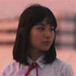

# image_to_latent
from 3x128x128 image to 4096 latent and decoded back

1st image - original

2nd image - decoded from latent

// the image wasn't in the training data which was only anime

original, model output
:-------------------------:
 
